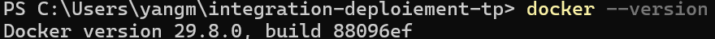
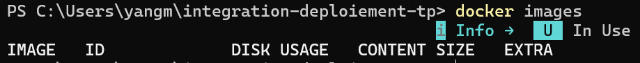
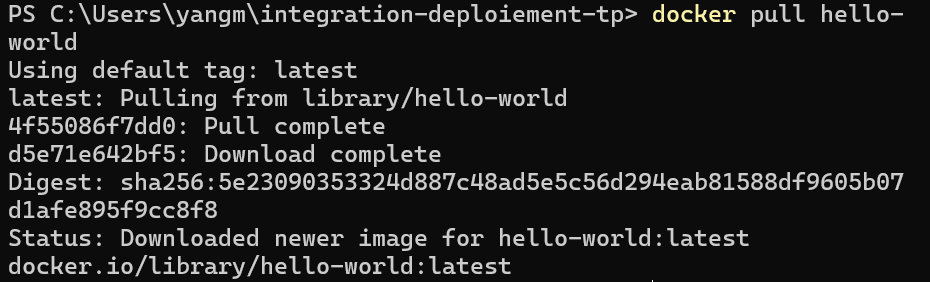
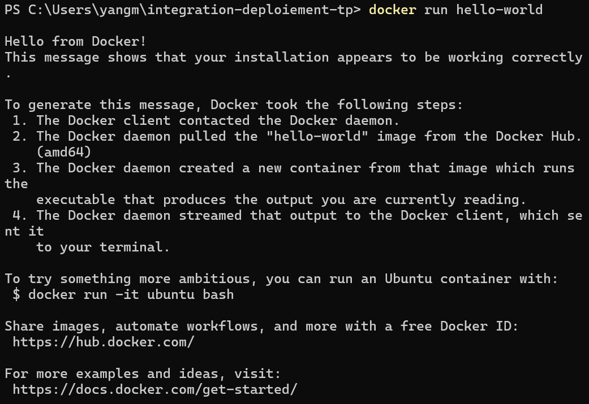
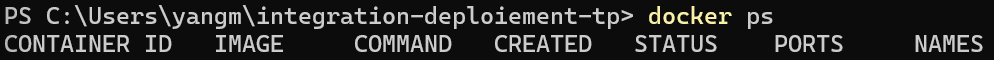
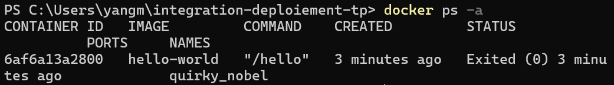
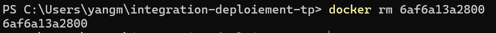
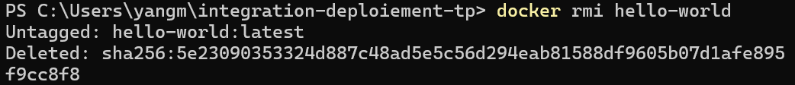

# Exercice : Manipulation de base des conteneurs

### 1. Vérifier la version de Docker

---

### 2. Lister les images locales

---

### 3. Télécharger l'image hello-world

---

### 4. Exécuter un conteneur

---

### 5. Lister les conteneurs en cours d'exécution

---

### 6. Lister tous les conteneurs (actifs et stoppés)

---

### 7. Supprimer le conteneur

---

### 8. Supprimer l'image

---