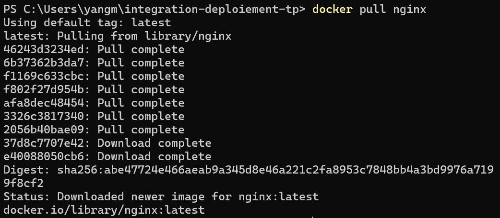
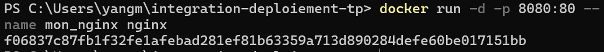
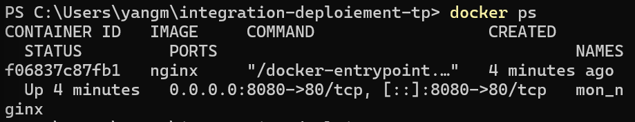
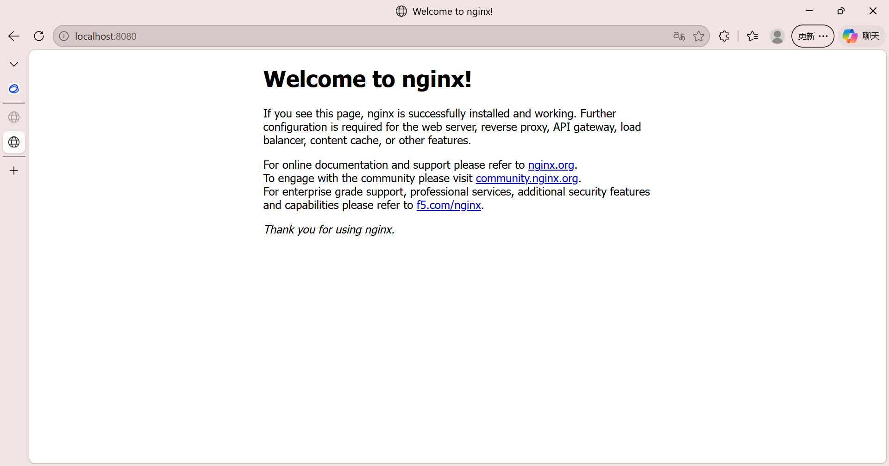
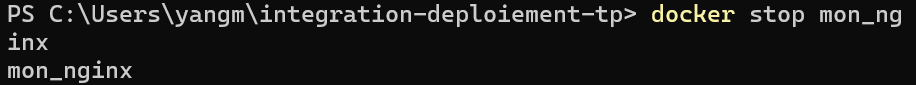
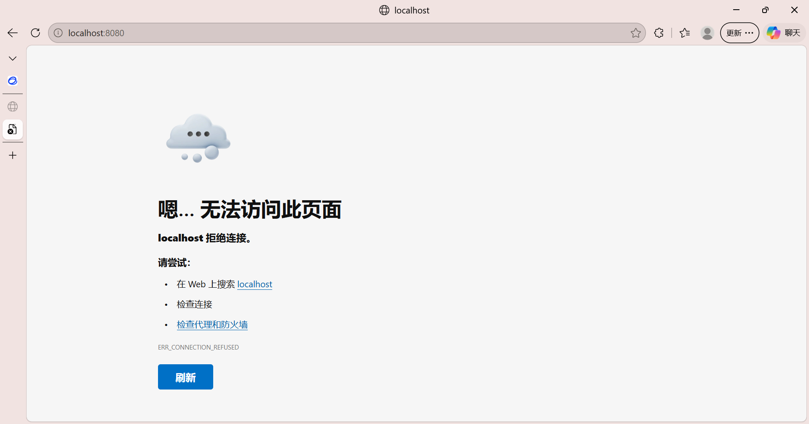
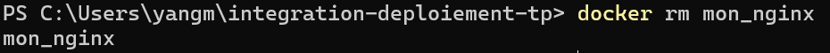

# Exercice : Création d'un serveur web avec Docker

### 1. Téléchargez l'image officielle Nginx

---

### 2. Lancez un conteneur Nginx en arrière-plan （Démarre un serveur web accessible sur http://localhost:8080.）

---

### 3. Vérifiez que le conteneur est actif

---

### 4. Accédez à la page dans votre navigateur pour voir la page par défaut de Nginx.

---

### 5. Arrêtez le conteneur

---

### 6. Supprimez le conteneur

---
