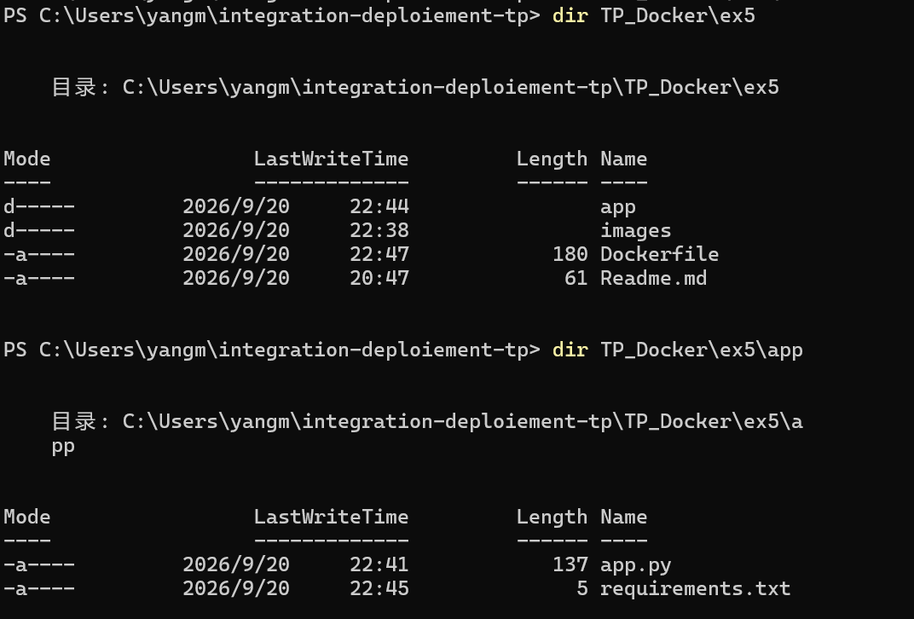
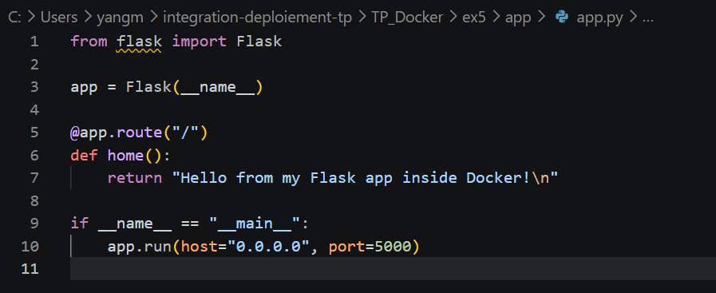
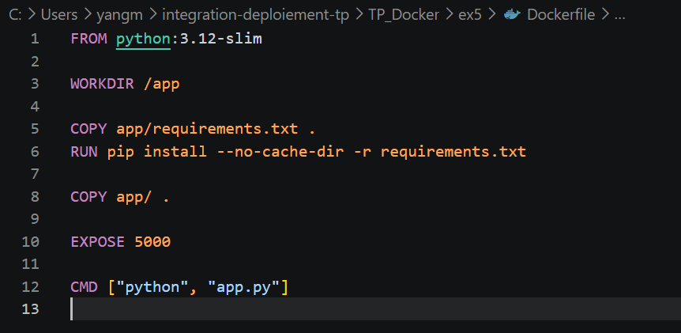
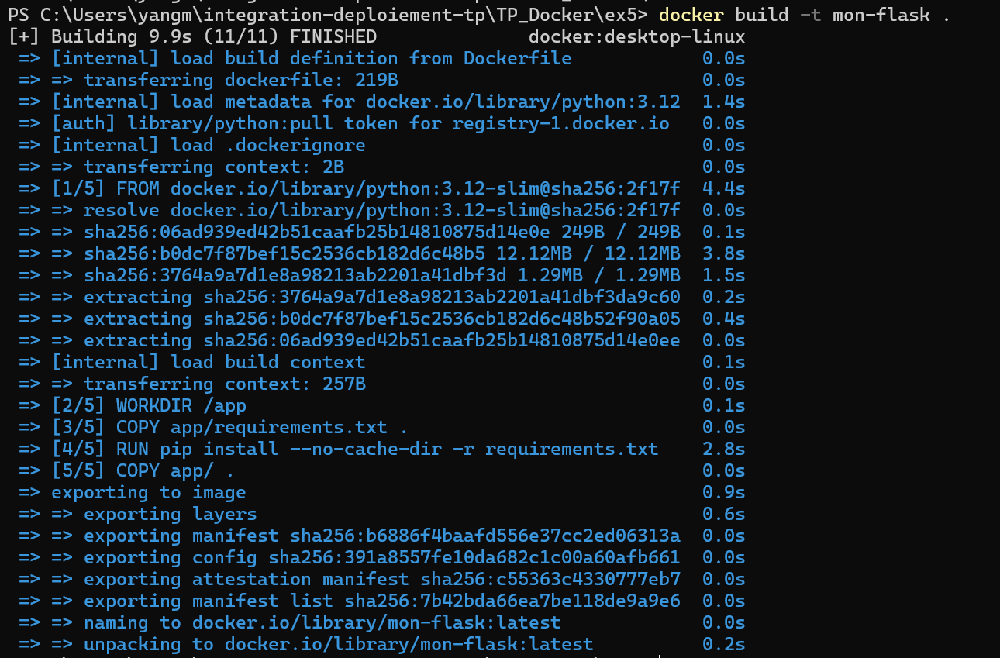
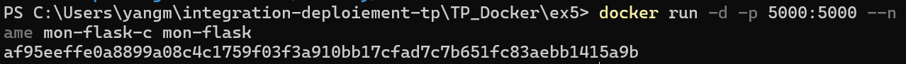
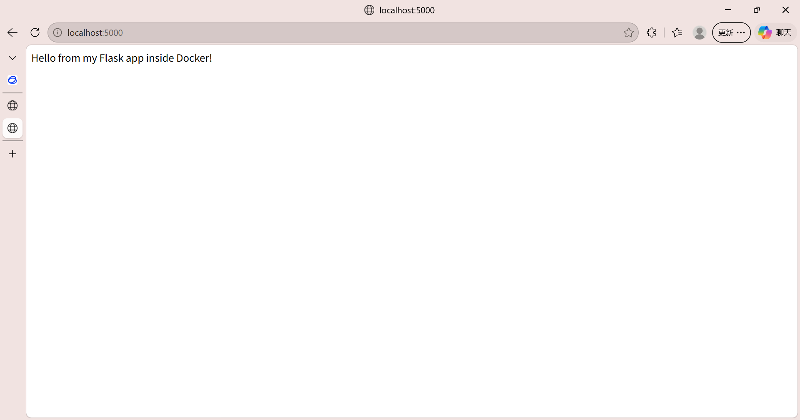
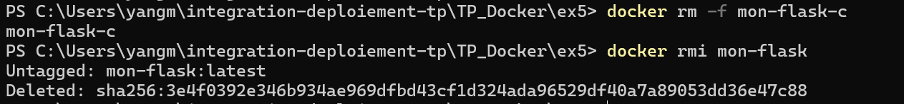

# Exercice : Déploiement d'une application Python Flask

### 1. Fichiers du projet

---

### 2.  fichier app.py

---

### 3. fichier Dockerfile

---

### 4. Construction de l'image

---

### 5. Lancement du conteneur

---

### 6. Test navigateur

---

### 7. Nettoyage

---
