# Exercice : Docker Compose avec MongoDB

### 1. Fichiers du projet
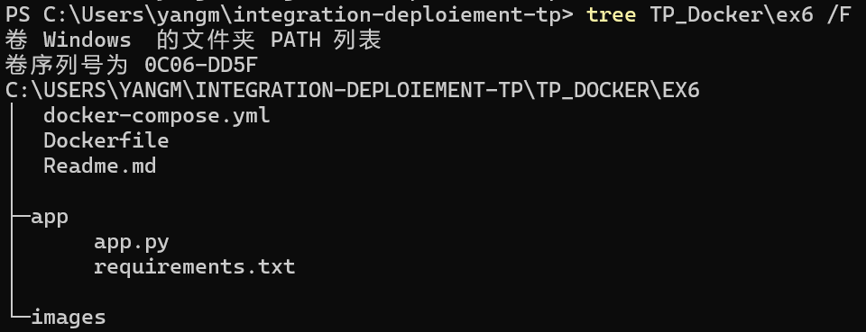

---

### 2.  fichier app.py
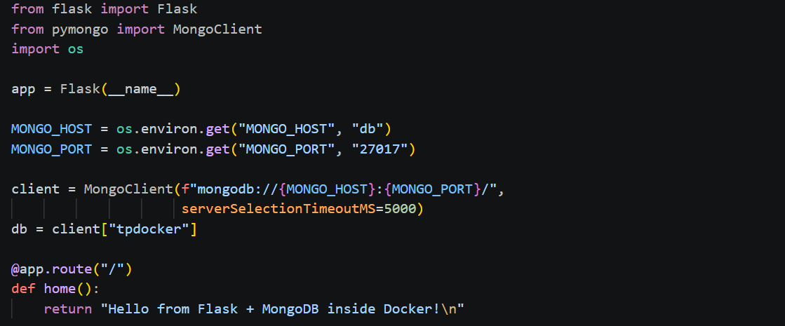
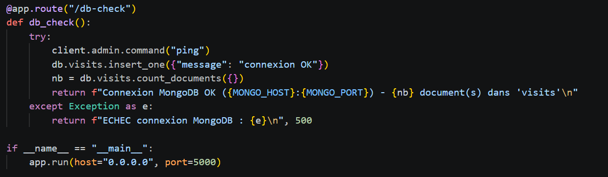

---

### 3. fichier Dockerfile
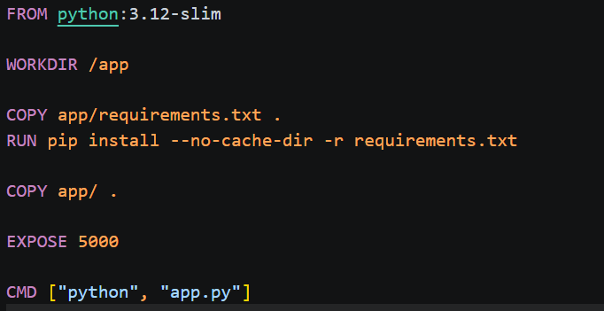

---

### 4. fichier docker-compose.yml
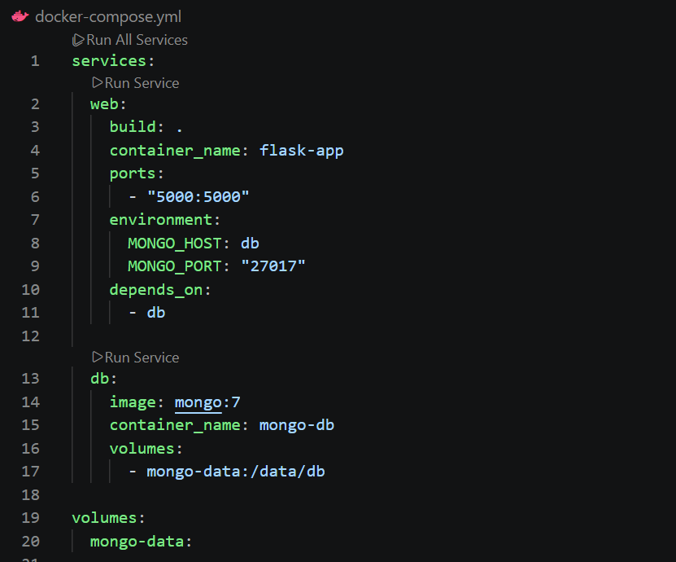

---

### 5. Construction
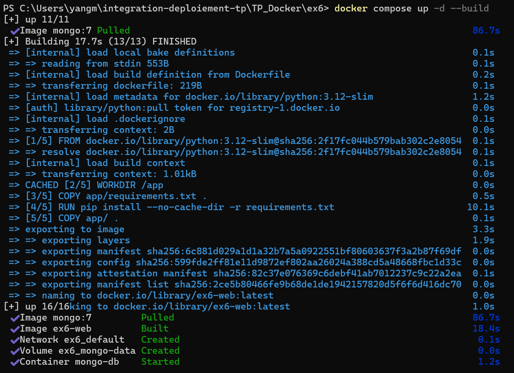

---

### 6. Lancement
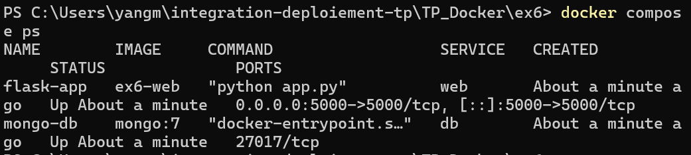

---

### 7. Vérification de la connexion à la BDD
#### 7.1 Via l'application Flask(http://localhost:5000/db-check)
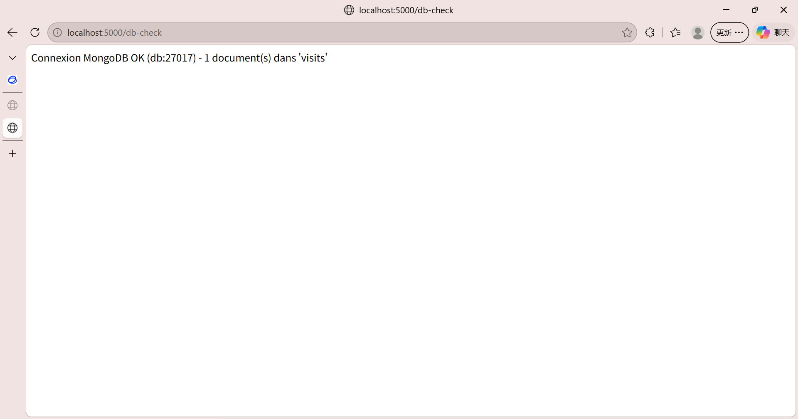

#### 7.2 Preuve directe dans le conteneur MongoDB
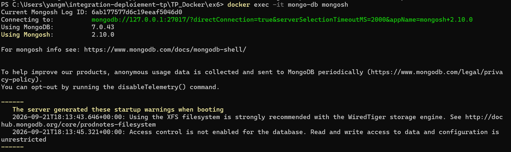
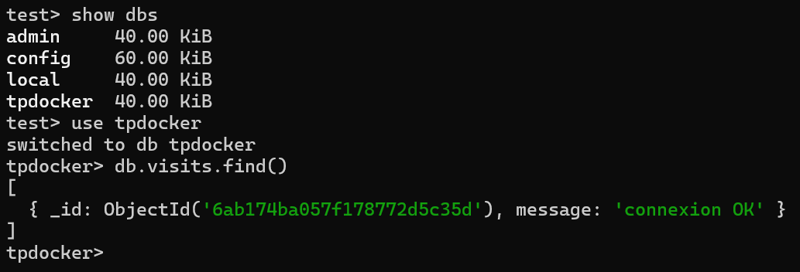

---

### 8. Nettoyage
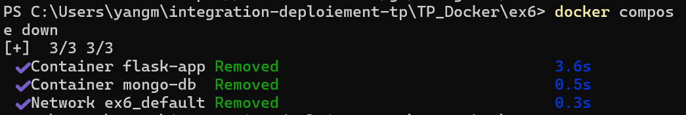

---
